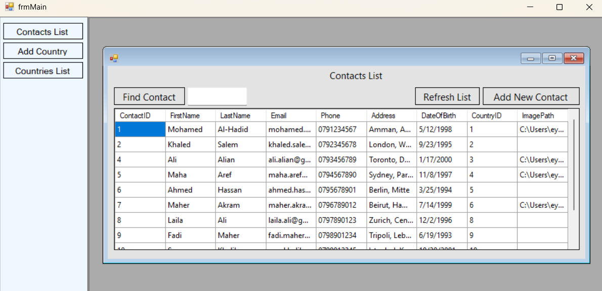
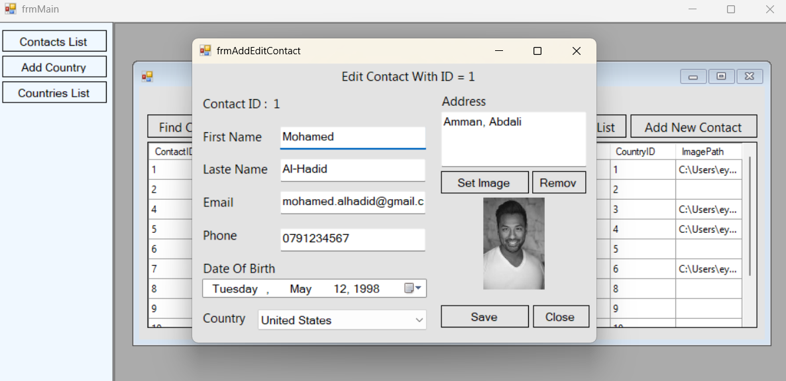
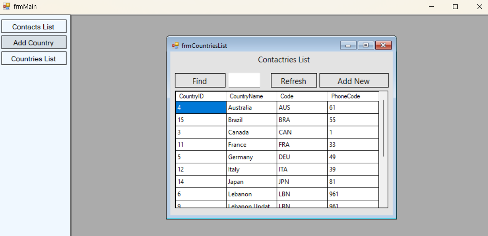
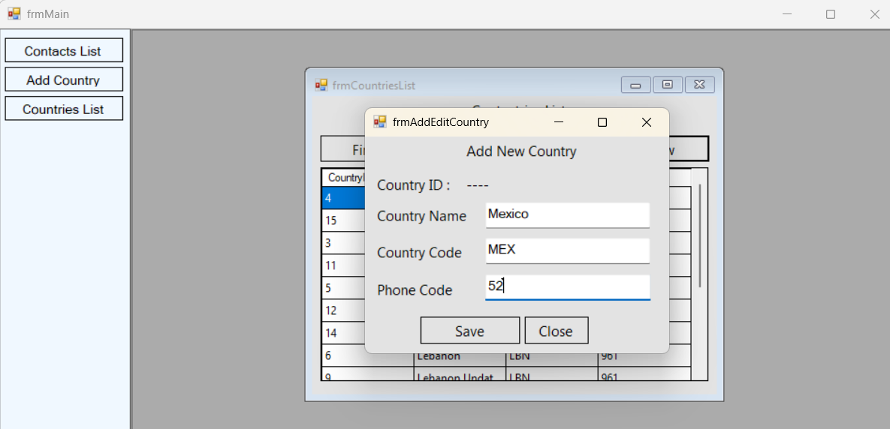

# ContactsDesktopPresentation

A contacts management project that allows control over people's data and their associated countries. The main page provides three core options:

- **Contacts List** — view all contacts, with search and add capabilities, plus edit or delete any contact via a right-click context menu (Delete Contact / Edit Contact)
- **Add Country** — add a new country directly
- **Countries List** — view the list of countries with search and add capabilities

## Original Project

This project depends on two core Class Library projects, originally created as part of the [ContactHub](https://github.com/aymanhabbashprogramming/ContactHub) repository:

- **ContactsBusinessLayer** — Business Logic Layer
- **ContactsDataAccessLayer** — Data Access Layer

This reflects one of the key highlights of this project: a practical application of 3-Tier Architecture, where the work here is limited to the Presentation Layer only, reusing the same business logic and data access without duplicating code.

## Technologies Used

- **C#**
- **WinForms**

## Project Structure

The solution consists of three projects linked through References:

- **ContactsDataAccessLayer** — Data access layer (from ContactHub)
- **ContactsBusinessLayer** — Business logic layer (from ContactHub)
- **ContactsDesktopPresentation** — Presentation layer (WinForms UI, new in this project)

Each layer depends only on the layer directly below it (PL → BLL → DAL), achieving a clear separation of concerns.

### How the Layers Are Linked

The `ContactsBusinessLayer` and `ContactsDataAccessLayer` projects were added to the solution as Existing Projects, referencing their original paths within the `ContactHub` repository, then linked via Project References:

1. `ContactsBusinessLayer` referenced `ContactsDataAccessLayer`
2. `ContactsDesktopPresentation` referenced `ContactsBusinessLayer`

This way, no code is duplicated; both `ContactHub` and `ContactsDesktopPresentation` share the exact same files for the BLL and DAL layers.

## Screenshots

### Contacts List

The main contacts grid, showing all stored contacts with search and add options.

---

### Edit Contact

Editing an existing contact, opened via the right-click context menu on the Contacts List.

---

### Countries List

The countries grid, showing all stored countries with search and add options.

---

### Add Country

The form used to add a new country directly.

